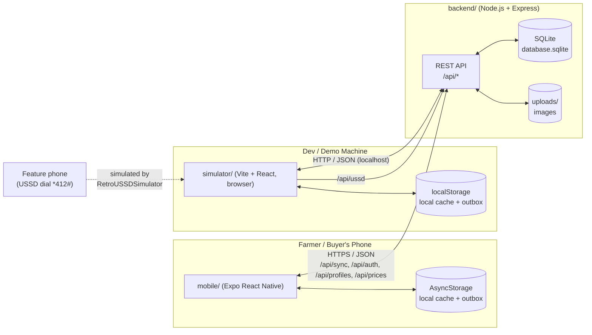
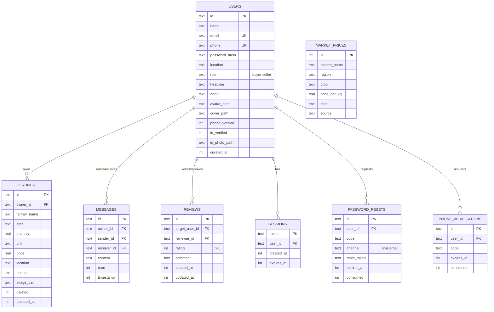

# OKUANI — Detailed Project Documentation

**A Mobile Application Connecting Smallholder Farmers to Buyers and Real-Time Market Price
Information, with Offline-First Access**

| | |
|---|---|
| **Student** | Obeng Mensah Jacob (9031723) |
| **Supervisor** | Dr. K Agyemang |
| **Department** | Computer Science, KNUST |
| **Degree** | BSc. Computer Science |
| **Source proposal** | [`OKUANI_Project_Proposal (1).docx`](OKUANI_Project_Proposal%20%281%29.docx) / [`proposal_extracted.txt`](proposal_extracted.txt) |
| **Companion document** | [`IMPLEMENTATION_REVIEW.md`](IMPLEMENTATION_REVIEW.md) — what of this has actually been built, verified against the code |

This document expands the original proposal into an implementation-grade specification: every
objective is broken into concrete, testable acceptance criteria; the architecture is drawn out as
diagrams and concrete data models; the sync protocol is specified step-by-step; and every screen,
endpoint, and table that exists in the repository today is catalogued. Where this document
describes something as a *design decision*, that decision has already been made in code — see
`IMPLEMENTATION_REVIEW.md` for the honest "is it actually there" audit.

---

## Table of Contents

1. [Executive Summary](#1-executive-summary)
2. [Background & Problem Statement](#2-background--problem-statement)
3. [Objectives & Acceptance Criteria](#3-objectives--acceptance-criteria)
4. [System Architecture](#4-system-architecture)
5. [Data Model](#5-data-model)
6. [API Reference](#6-api-reference)
7. [Offline-First Design & Sync Protocol](#7-offline-first-design--sync-protocol)
8. [Security Model](#8-security-model)
9. [Screens & User Flows](#9-screens--user-flows)
10. [SMS/USSD Channel](#10-smsussd-channel)
11. [Testing Strategy](#11-testing-strategy)
12. [Deployment & Environment Configuration](#12-deployment--environment-configuration)
13. [Risk Register](#13-risk-register)
14. [Literature Review (expanded)](#14-literature-review-expanded)
15. [Suggested Timeline / Milestones](#15-suggested-timeline--milestones)
16. [Glossary](#16-glossary)
17. [References](#17-references)

---

## 1. Executive Summary

Smallholder farmers in rural Ghana lose income to two compounding problems: no direct channel to
buyers, and no visibility into fair market prices — both worsened by unreliable rural internet.
OKUANI is a mobile-first marketplace and price-transparency platform that treats offline access as
a first-class design constraint rather than a degraded fallback. A farmer can list produce, browse
cached prices, and message a buyer with zero network connectivity; the app queues those actions
locally and reconciles them with the server automatically the moment connectivity returns, using a
timestamp-based last-write-wins conflict strategy.

The project is delivered as three cooperating pieces:

- **`mobile/`** — the actual deliverable: an Expo/React Native app implementing farmer and buyer
  portals, a price dashboard, in-app messaging, profiles/reviews, authentication, and the
  offline-first sync engine.
- **`backend/`** — a Node.js/Express REST API that is the authoritative data store and sync
  counterparty, plus a simulated USSD endpoint for the stretch goal.
- **`simulator/`** — a browser-based demonstration harness that mirrors the mobile UI alongside a
  live sync-engine inspector and a server database monitor, purpose-built for showing offline/online
  transitions during a defense without needing a physical Android device.

## 2. Background & Problem Statement

Agriculture employs a large share of Ghana's rural workforce and contributes significantly to
GDP, yet smallholder farmers routinely sell below fair value. Two informational failures drive
this: (1) no direct route to buyers beyond the immediate locality, forcing reliance on middlemen who
extract a margin by citing transport cost, spoilage risk, or simply exploiting the farmer's lack of
comparative pricing; and (2) no access to real-time or cross-market price data, so a farmer cannot
tell whether today's offer is fair. A third, infrastructural factor compounds both: intermittent or
absent internet connectivity in rural areas means purely-online tools are unusable exactly where
they're needed. Existing regional precedents (Esoko, Farmerline for SMS-based price info; Twiga
Foods, Farmcrowdy for direct farmer-buyer linkage in Kenya/Nigeria) each solve one half of the
problem, but generally assume continuous connectivity that rural Ghana cannot guarantee. OKUANI's
premise is that the marketplace and the price dashboard need to be the *same* offline-first app,
not two separate tools bolted together.

## 3. Objectives & Acceptance Criteria

The proposal's §3.2 lists seven specific objectives. Each is restated below with concrete,
testable acceptance criteria — the standard this documentation holds the implementation to.

### 3.1 General Objective
Design and implement an offline-first mobile application (with an optional SMS/USSD channel) that
connects smallholder farmers directly to buyers and provides accessible market price information,
improving price transparency and farmer income even with limited/intermittent connectivity.

### 3.2 Specific Objectives

| # | Objective | Acceptance Criteria |
|---|---|---|
| 1 | Farmers create/manage produce listings (crop, quantity, location, price, availability) from the app | A farmer can create, edit, and soft-delete a listing with crop type, quantity+unit, price, location, and phone, entirely from the mobile UI; listings persist across app restarts |
| 2 | Buyers search/filter listings by crop, location, price range, quantity | The buyer portal supports free-text search (crop/farmer name), a location filter, and a price-range + minimum-quantity filter, all combinable |
| 3 | Market price dashboard aggregating/visualizing trends across regions/markets | A dashboard lists current price-per-kg per crop/market with day-over-day change and trend direction, plus a drill-down trend chart over 7D/30D/3M/6M/1Y |
| 4 | Basic in-app messaging between farmers and buyers | A buyer can message a listing's farmer; both parties see a threaded conversation with read/unread state, persisted and synced |
| 5 | Offline-first design — cache listings/prices locally, auto-sync on reconnect | All of objectives 1–4 continue to function with zero network reachability; queued changes upload automatically the moment the device reconnects, with no user-initiated "retry" required |
| 6 | Simulated offline mode — a toggle/testing harness that forces no-connectivity on demand, for dev/test/defense | A visible, reachable in-app control flips the app into a simulated-offline state independent of real device connectivity, so the offline behaviour above can be demonstrated live without airplane mode or a throttled network |
| 7 | *(Stretch)* SMS/USSD channel for farmers without smartphones | A USSD-style menu (dial-string driven) lets a feature-phone user check average crop prices, see how many listings are live, and register a new listing, without the app |

## 4. System Architecture

### 4.1 Component Diagram



### 4.2 Layered View (maps to proposal §5.2)

| Proposal layer | Proposal's suggestion | What's implemented | Where |
|---|---|---|---|
| Mobile frontend | React Native (Expo) or Flutter, Android-first | Expo/React Native, cross-platform (Android + iOS + web preview) | `mobile/` |
| Local/offline storage | SQLite via WatermelonDB or Realm | AsyncStorage (JSON blob: listings, messages, prices, priceSummary) | `mobile/src/hooks/useOfflineDb.js` |
| Backend | Node.js + Express (or Django), REST/GraphQL | Node.js + Express, REST | `backend/server.js`, `backend/routes/*.js` |
| Server database | PostgreSQL or MySQL | SQLite (`backend/database.sqlite`) | `backend/server.js: initDb()` |
| Sync layer | Background service, queue + conflict resolution | `POST /api/sync`: client pushes unsynced items, server applies last-write-wins by `updated_at`/timestamp, returns server-side deltas since `lastSync` | `backend/server.js` (`/api/sync` handler), `mobile/src/hooks/useOfflineDb.js` |
| SMS/USSD | Africa's Talking API | Simulated dial-string state machine, no live telco | `backend/server.js` (`/api/ussd`), `simulator/src/components/RetroUSSDSimulator.jsx` |
| Hosting | Render / Railway / university server | Not yet deployed — runs locally for development/demo | — |

### 4.3 Why the Simulator Exists Separately From the Mobile App

The proposal's §5.3 calls for the simulated-offline mode to be *demonstrable during the project
defense* without a live low-connectivity environment. A defense room rarely has a reliable way to
project a phone screen with good contrast, and toggling airplane mode live on a physical device is
fragile to demo. `simulator/` solves this by rendering the same farmer/buyer/price UI in a browser
window, next to an always-visible **Sync Engine Live Telemetry** log and a **server database
monitor** — so an examiner can watch a listing move from "local outbox" to "synced to server" in
real time, with the causal steps narrated by the log panel. It is explicitly *not* the deliverable
itself (§5.2 scopes the deliverable as the mobile app) — it exists purely as a defense/demo
instrument, and its feature set is intentionally a mirror of `mobile/`'s, not a superset.

## 5. Data Model

All tables live in `backend/database.sqlite`, created idempotently by `initDb()` in
`backend/server.js`. Columns marked "additive" were added later via `ALTER TABLE` (see
`ensureColumn()`), since these tables predate features like auth and profiles.



Notes:

- **Guests** (unauthenticated users) have no row in `users` at all — a client-generated
  `guest-<random>` id is used as `owner_id` on their listings/messages, trusted at face value only
  because it's prefixed `guest-`. Signing up later "claims" those rows via `POST /api/auth/merge`.
- **`market_prices`** stores a full trailing history per `(crop, market_name)`, not just "today's
  price" — this is what powers the 7D/30D/3M/6M/1Y trend charts. `/api/prices` collapses this to
  latest-per-combo for the plain listing view.
- **Reviews** are one-per-`(target_user_id, reviewer_id)` pair (`UNIQUE` constraint) — submitting a
  second review updates the first rather than creating a duplicate.

## 6. API Reference

Base URL: `http://<host>:5000` (configurable via `PORT`). All bodies are JSON; error responses are
`{ "error": "..." }` with a 4xx/5xx status.

### 6.1 Health

| Method | Path | Auth | Description |
|---|---|---|---|
| GET | `/health` | — | Liveness check, `{ status: 'ok', service: 'okuani-backend' }` |

### 6.2 Auth (`/api/auth`, `backend/routes/auth.js`)

| Method | Path | Auth | Body | Description |
|---|---|---|---|---|
| POST | `/signup` | — | `{ name, email?, phone?, password }` | Creates a user (email or phone required), returns `{ token, user }` |
| POST | `/login` | — | `{ identifier, password }` | Identifier is email or phone; returns `{ token, user }` |
| POST | `/forgot-password/request` | — | `{ identifier, channel: 'sms'\|'email' }` | Issues a 6-digit code (5 min TTL), logged to console (`devCode` also returned — no real SMS/email provider wired up) |
| POST | `/forgot-password/verify` | — | `{ resetId, code }` | Exchanges a valid code for a one-time `resetToken` |
| POST | `/reset-password` | — | `{ resetToken, newPassword }` | Sets new password, returns a fresh session `{ token, user }` |
| POST | `/verify-password` | Bearer | `{ password }` | Re-confirms the current password (e.g. before a sensitive action) |
| POST | `/logout` | Bearer | — | Deletes the session row for the presented token |
| POST | `/merge` | Bearer | `{ guestId }` | Reassigns a guest's listings/messages to the now-logged-in user; `guestId` must be `guest-`-prefixed and unclaimed |

### 6.3 Profiles (`/api/profiles`, `backend/routes/profiles.js`)

| Method | Path | Auth | Description |
|---|---|---|---|
| GET | `/:userId` | — | Public profile: user fields + their active listings + reviews + average rating |
| GET | `/:userId/reviews` | — | Just the reviews list |
| POST | `/:userId/reviews` | Bearer | Leave/update a review (1–5 rating); requires prior message contact with the target, and you can't review yourself |
| PATCH | `/me` | Bearer | Update `name/headline/about/email/phone/location/role`; email/phone uniqueness enforced |
| GET | `/me/contacts` | Bearer | Distinct users you've exchanged messages with |
| POST | `/me/photo` | Bearer | `{ slot: 'avatar'\|'cover'\|'id', imageBase64 }` — saves a photo, deletes the old one |
| GET | `/me/id-photo` | Bearer | Your own ID photo URL (never exposed via the public `:userId` route) |
| POST | `/me/verify-phone/request` | Bearer | Issues a phone verification code (5 min TTL) |
| POST | `/me/verify-phone/confirm` | Bearer | `{ verificationId, code }` → flips `phone_verified` |
| POST | `/me/verify-id` | Bearer | Demo-only affordance that flips `id_verified` with no real document check |

### 6.4 Prices, Listings, Sync (`backend/server.js`)

| Method | Path | Auth | Description |
|---|---|---|---|
| GET | `/api/prices` | — | Latest price per `(crop, market_name)`, ascending by price |
| GET | `/api/prices/summary` | — | Latest vs. previous price, `change`, `percentChange`, `trend` (`up`/`down`/`stable`) per combo — feeds dashboard cards |
| GET | `/api/prices/history?crop=&market_name=&period=` | — | Time series for one crop(+market) over `7d\|30d\|3m\|6m\|1y`, plus current/previous/high/low |
| POST | `/api/prices/report` | — | `{ market_name, region, crop, price_per_kg, source? }` — crowd-sourced price submission (proposal §5.4) |
| GET | `/api/listings` | — | All non-deleted listings |
| GET | `/api/db-state` | Bearer | Full listings/messages/prices snapshot — powers the defense-console server monitor |
| POST | `/api/db-reset` | Bearer | Wipes and re-seeds the database (demo convenience) |
| POST | `/api/sync` | Bearer\* | The offline-first sync endpoint — see §7 below (\*Bearer required only when `ownerId` is a real, non-guest user id) |

### 6.5 USSD (`backend/server.js`)

| Method | Path | Description |
|---|---|---|
| POST | `/api/ussd` | `{ text, phoneNumber }` — Africa's-Talking-style dial-string state machine; see §10 |

## 7. Offline-First Design & Sync Protocol

### 7.1 Client-Side Model

Both `mobile/` (`useOfflineDb.js`) and `simulator/` keep one local "database" object:

```
{ listings: [...], messages: [...], prices: [...], priceSummary: [...] }
```

Every locally-created or locally-edited `listing`/`message` gets `synced: false` until the server
confirms it. `networkStatus` is derived as:

```
networkStatus = (!simulateOffline && deviceOnline) ? 'online' : 'offline'
```

i.e. the manual demo toggle (objective #6) always wins over the real radio state — flipping it on
forces offline behavior even with a perfectly good Wi-Fi connection, which is what makes the
behavior demonstrable on demand rather than only when the network actually happens to be down.

### 7.2 Sync Sequence

```mermaid
sequenceDiagram
    participant App as Mobile App / Simulator
    participant Cache as Local Cache (AsyncStorage / localStorage)
    participant API as Backend /api/sync
    participant DB as SQLite

    Note over App: User creates a listing while OFFLINE
    App->>Cache: save listing {synced:false}, updated_at=now

    Note over App: Connectivity returns (deviceOnline flips true,\nor simulateOffline flips off)
    App->>App: detect networkStatus 'offline' -> 'online'
    App->>API: POST /api/sync {lastSync, ownerId, changes:{listings:[...unsynced], messages:[...unsynced]}}
    API->>API: authenticate ownerId (guest- prefix trusted, else Bearer session must match)
    API->>DB: BEGIN TRANSACTION
    loop each changed listing
        API->>DB: SELECT existing row by id
        alt no existing row
            API->>DB: INSERT
        else client.updated_at > server.updated_at
            API->>DB: UPDATE (client wins)
        else
            API->>API: log "conflict: server kept" (server wins, no write)
        end
    end
    loop each changed message
        API->>DB: INSERT if new & caller is a participant
        API->>DB: UPDATE read=1 if receiver is marking their own thread read
    end
    API->>DB: COMMIT
    API->>DB: SELECT listings WHERE updated_at > lastSync
    API->>DB: SELECT messages WHERE timestamp > lastSync AND caller is a participant
    API-->>App: {serverTime, changes:{listings, messages}, logs:[...]}
    App->>Cache: mark pushed items synced:true; merge server deltas (skip if local item is newer & still unsynced)
    App->>Cache: lastSyncTime = serverTime
```

### 7.3 Conflict Resolution

The strategy is **last-write-wins by `updated_at` timestamp**, applied independently per record:

- **Listings**: if both a local edit and a server-side change exist for the same `id`, whichever
  has the larger `updated_at` wins. This is symmetric — the server enforces it when applying
  pushed changes, and the client enforces the same rule when merging the server's returned deltas
  back into local state (`useOfflineDb.js`'s `syncData`), so a stale server echo can never
  clobber a newer unsynced local edit while the two are in flight past each other.
- **Messages**: messages are treated as immutable/append-only once created — the only field ever
  updated post-creation is `read`, and only the receiving participant may flip it, so there is no
  content-conflict case to resolve for chat history itself.
- **Ownership**: a listing/message with an `owner_id` already set can only be modified by a sync
  request presenting that same effective owner id — this prevents one user's sync batch from
  overwriting or soft-deleting another user's records (see §8).

### 7.4 What Remains Usable Fully Offline

Per objective #5, every one of these works with `networkStatus === 'offline'` and zero backend
reachability, reading/writing only the local cache:

- Browsing all previously-cached listings and prices
- Creating, editing, soft-deleting a listing (farmer)
- Searching/filtering listings (buyer)
- Composing and sending a message (queued)
- Viewing the price dashboard and previously-cached trend charts
- Viewing your own profile's cached listings

What *requires* connectivity by nature (not a gap, just physically online-only): fetching another
user's live profile for the first time, uploading a new photo, requesting a password-reset/phone
verification code, and of course the sync push/pull itself.

## 8. Security Model

- **Passwords**: bcrypt-hashed (`bcryptjs`, cost 10), never stored or returned in plaintext.
- **Sessions**: opaque random 32-byte bearer tokens (`crypto.randomBytes(32)`), 30-day TTL, stored
  server-side in `sessions` and checked on every `requireAuth`-guarded route.
- **Guest identity**: a client-generated `guest-<id>`, trusted as a bearer capability with no
  password — anyone who learns a guest id can act as that guest. This is an intentional, documented
  trade-off for a frictionless "try before you sign up" flow, not an oversight; it stops being a
  concern the moment the guest signs up and their data is merged into a real password-protected
  account via `/api/auth/merge`.
- **Ownership checks** (`/api/sync`): a caller may only create/modify a listing or message under a
  non-guest `ownerId` if their bearer session's `user_id` matches it — otherwise `owner_id` (which
  is publicly readable via `GET /api/listings`) would let any authenticated caller impersonate any
  other real user's writes.
- **Guest-merge guardrail**: `guestId` passed to `/api/auth/merge` must be `guest-`-prefixed *and*
  unclaimed by any real user row — otherwise a malicious caller could pass a victim's real user id
  and reassign the victim's listings/messages to themselves.
- **Private data gating**: `/api/db-state` (used by the defense console's server monitor) requires
  a session, since it exposes message content across all users, not just the caller's own.
- **ID photo isolation**: `GET /api/profiles/me/id-photo` reads only `req.user` from the session,
  never a route parameter, so it can never leak another user's ID photo through URL manipulation.

## 9. Screens & User Flows

### 9.1 Mobile App Screen Inventory (`mobile/src/screens/`)

| Screen | Purpose |
|---|---|
| `WelcomeScreen` | Landing screen, single "Continue" entry into auth |
| `LoginScreen` / `SignUpScreen` | Email-or-phone + password auth, "Continue as Guest" escape hatch |
| `ForgotPasswordRequestScreen` → `VerifyCodeScreen` → `ResetPasswordScreen` | 3-step password reset (request code → verify → set new password) |
| `FarmerPortalScreen` | Home for the seller role: create/manage own listings, network/sync status hero |
| `BuyerPortalScreen` | Search + filter (crop/farmer text, location, price range, min quantity) all listings |
| `PriceDashboardScreen` | Crop price cards with trend arrows, tap-through to detail |
| `ProductPriceTrendScreen` | Historical chart for one crop/market over a selectable period |
| `ChatScreen` | 1:1 conversation thread with a listing's farmer/buyer |
| `ConversationsScreen` | Inbox of all threads, unread badge |
| `ProfileScreen` | View/edit own or another user's profile — contact info, bio, listings, reviews, **Appearance** (theme), and (own profile only) the **Sync & Defense Console** (network/simulate-offline toggle, force-sync, server DB monitor, live sync log, reset-all) |

### 9.2 Primary User Flow — Farmer Lists Produce Offline

1. Farmer opens the app (already logged in or as guest) → `FarmerPortalScreen`.
2. Flips "Simulate Offline" on from the Profile screen's Sync & Defense Console (or is genuinely
   out of signal).
3. Taps "Add Listing", fills crop/quantity/unit/price/location/phone, saves.
4. Listing appears immediately in their own list, tagged locally as unsynced (sync icon in header).
5. Farmer reconnects (flips the toggle back, or regains signal) → `useOfflineDb`'s network-status
   watcher fires `syncData()` automatically.
6. The listing round-trips through `/api/sync`, comes back `synced: true`, and is now visible to
   every buyer via `GET /api/listings`.

### 9.3 Simulator-Specific Flow (Defense Demo)

Documented in [`README.md`](../README.md#project-defense-demonstration-scenarios): create a
listing online (instant sync), toggle **Simulate Offline** in the dev console, create a second
listing (queued, visible in the local outbox but absent from the **SQLite Server Database
Monitor**), toggle back online, and watch the **Sync Engine Live Telemetry** log the upload and the
listing appear in the server monitor in real time.

## 10. SMS/USSD Channel

Implements the proposal's stretch goal (§3.2 item 7) as a simulated dial-string state machine
(`POST /api/ussd`), driven from `simulator/src/components/RetroUSSDSimulator.jsx` (a retro phone
dialer UI dialing `*412#`) rather than a live Africa's Talking integration:

| Input (`text`) | Response |
|---|---|
| *(empty)* | Welcome menu: 1) Check Market Prices 2) View Local Listings 3) Register Crop Sale |
| `1` | Lists distinct crops with average price/kg |
| `1*<n>` | Per-market breakdown for the *n*-th crop |
| `2` | Count of active listings, points to the app for detail |
| `3` | Prompts for `Crop*Qty*Price` format |
| `3*<crop>*<qty>*<price>` | Inserts a new listing attributed to `USSD Farmer`, confirms |
| anything else | "Invalid option. Dial *412# to restart." |

This only exists in `simulator/`, not `mobile/`, since real USSD codes are dialed from a phone's
native dialer outside any app — there is nothing for an in-app screen to render.

## 11. Testing Strategy

Per proposal §5.5 (unit, integration, UAT, offline-behaviour validation):

- **Automated**: `simulator/` has a Vitest suite (`npm test` from `simulator/`) covering shared API
  utilities and sync logic.
- **Manual/offline validation**: the Simulate Offline toggle (mobile Profile screen, or the
  simulator's dev console) is the primary instrument for exercising "create while offline, confirm
  sync on reconnect" and "cached reads while offline" scenarios described in §5.5, without needing
  a real low-connectivity environment.
- **UAT**: the proposal suggests students role-playing farmers/buyers, or a small pilot group — not
  yet formalized; a script for this is a natural next artifact (see backlog in
  `IMPLEMENTATION_REVIEW.md`).

## 12. Deployment & Environment Configuration

| Component | Local dev | Notes |
|---|---|---|
| `backend/` | `npm start` → `http://localhost:5000` | `PORT` env var overrides; binds to all interfaces by default (Express default), so a LAN/hotspot IP reaches it from another device |
| `simulator/` | `npm run dev` → `http://localhost:3000` | Talks to `localhost:5000` directly (same machine) |
| `mobile/` | `npm start` (Expo) | Requires `mobile/.env`: `EXPO_PUBLIC_API_BASE_URL` / `EXPO_PUBLIC_WEB_BASE_URL` pointed at the dev machine's **current** LAN or hotspot IP — `localhost` only resolves for a browser preview or emulator with port-forwarding, not a physical device. **This must be updated by hand every time the dev machine's network changes** (new Wi-Fi, new mobile hotspot) — see `mobile/.env.example` for the template. |

Proposed (not yet done) production path: swap SQLite for PostgreSQL/MySQL, deploy `backend/` to
Render/Railway, point `mobile/.env` at the deployed HTTPS URL, and build a real Expo binary.

## 13. Risk Register

| Risk | Likelihood | Impact | Mitigation |
|---|---|---|---|
| SQLite server DB doesn't scale/concurrency-handle a real multi-user deployment | Medium (only matters past prototype stage) | Medium | Documented deviation; swap to Postgres before production (`README.md` "Deviations from the proposal") |
| Mobile `.env` LAN IP goes stale after a network change, silently breaking login/sync for physical-device testing | High (happens every time the dev network changes) | Medium — looks like a broken login, not a config issue | Documented in this file and `mobile/README.md`; consider a same-LAN auto-discovery or a checked-in dev proxy in a future iteration |
| Guest identity has no password — knowledge of the id is sufficient to act as that guest | Low (by design, mitigated by merge-on-signup) | Low | Accepted trade-off; already mitigated for anyone who converts to a real account |
| No live SMS/USSD provider — stretch goal is simulated only | Certain | Low (stretch goal, proposal explicitly allows simulation) | Clearly labelled as simulated everywhere it's surfaced (README, this doc, in-UI copy) |
| Offline demo/testing harness could regress silently (already happened once — see `IMPLEMENTATION_REVIEW.md`) | Medium | High — this is a core, examined objective | Keep the Sync & Defense Console reachable from a screen that's always in the nav (Profile), not a separate tab that can be quietly dropped |

## 14. Literature Review (expanded)

The proposal's §4 cites Esoko and Farmerline (SMS-based price info improving farmer bargaining
power) and Twiga Foods/Farmcrowdy (direct digital farmer-buyer linkage reducing post-harvest loss)
as precedent, while noting most such platforms assume continuous connectivity that doesn't hold in
rural Ghana. The offline-first pattern OKUANI adopts — local-first storage with background
sync — is well-established in fieldwork, health, and commerce apps for exactly this kind of
low-connectivity environment; the distinguishing choice here is combining that pattern with *both*
halves of the problem (marketplace matching *and* price transparency) in one app, rather than
treating them as separate tools, and building the offline behavior itself as something that can be
demonstrated on-demand (objective #6) rather than only observed incidentally when the network
happens to be down.

## 15. Suggested Timeline / Milestones

Not specified with dates in the original proposal; a reasonable phased breakdown for an academic
term, aligned to what's already built vs. remaining:

| Phase | Scope | Status |
|---|---|---|
| 1. Core data + backend | Listings/messages/prices schema, REST API, seed data | ✅ Done |
| 2. Offline-first mobile app | AsyncStorage cache, sync engine, farmer/buyer/price screens | ✅ Done |
| 3. Auth, profiles, trust signals | Signup/login/guest, profile editing, reviews, phone/ID verification | ✅ Done |
| 4. Defense/demo tooling | Simulate-offline toggle, sync log console, server DB monitor, browser simulator | ✅ Done (mobile console restored — see `IMPLEMENTATION_REVIEW.md`) |
| 5. Stretch: USSD | Simulated dial-string flow | ✅ Done (simulated) |
| 6. Hardening for "real" use | Postgres/MySQL backend, on-device SQLite/WatermelonDB, deployed hosting, live SMS/USSD | ⏳ Not started — documented as a known gap |
| 7. UAT | Structured role-play test script with a small user group | ⏳ Not started |
| 8. Written case study | Impact analysis on farmer income / market efficiency | ⏳ Not started |

## 16. Glossary

- **Offline-first**: an application design where local storage is the primary source of truth for
  reads/writes, and network sync is a background reconciliation step rather than a requirement for
  basic function.
- **Last-write-wins (LWW)**: a conflict-resolution strategy where, when two versions of the same
  record disagree, the one with the later timestamp is kept and the other discarded.
- **Guest identity**: a locally-generated, unauthenticated user id used to let someone use the app
  before creating an account; later "claimed" by merging into a real account.
- **Sync outbox**: the subset of local records not yet confirmed by the server (`synced: false`).
- **USSD**: Unstructured Supplementary Service Data — the `*123#`-style menu protocol feature
  phones use to interact with a server without a data connection or an app.

## 17. References

- Esoko Ghana — Market Price Information Services. https://esoko.com
- Farmerline — Digital Agricultural Solutions for Smallholder Farmers. https://farmerline.co
- Twiga Foods — B2B Food Distribution Platform. https://twiga.com
- Food and Agriculture Organization (FAO). (2021). *The State of Food and Agriculture in
  Sub-Saharan Africa.*
- Ghana Statistical Service. (2023). *Annual Agricultural Sector Report.*

*(Per the original proposal's own note: update this reference list with the specific sources
consulted during the literature review, formatted per department citation style.)*
